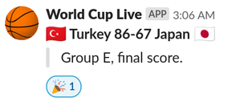

# NAME

fiba-world-cup-slack 0.01

# DESCRIPTION

FIBA World Cup game notifier in your Slack workspace.

Note that this only posts "game started" and "final score" notifications.

Run following command to install dependencies.

    cpanm File::Slurper Furl Getopt::Long List::Util JSON::XS

You can set a cronjob to run this script at every 5 minutes.

# SYNOPSIS

First, you will need a Slack incoming webhook URL. Here's how to get it:

- Create an app at [https://api.slack.com/apps?new\_app=1](https://api.slack.com/apps?new_app=1)
- Go to your app details page at [https://api.slack.com](https://api.slack.com)
- Go to "Incoming webhooks" on left navigation, it will be there.

Post from FIBA to screen

    perl fiba-world-cup-slack.pl

Post from FIBA to Slack

    perl fiba-world-cup-slack.pl --slack=https://hooks.slack.com/services/...

You can specify multiple Slack URLs

    perl fiba-world-cup-slack.pl --slack=... --slack=...

Post from local JSON file to screen

    perl fiba-world-cup-slack.pl --debug=downloaded.json

Post from local JSON file to Slack

    perl fiba-world-cup-slack.pl --debug=downloaded.json --slack=...

Add this to increase politeness sleep (defaults to 2 seconds)

    --sleep=10

# LICENSE

MIT.

# ATTRIBUTION

This script is based on
[kyzn/fifa-world-cup-slack](https://github.com/kyzn/fifa-world-cup-slack)
which was partly based on
[j0k3r/worldcup-slack-bot](https://github.com/j0k3r/worldcup-slack-bot).
